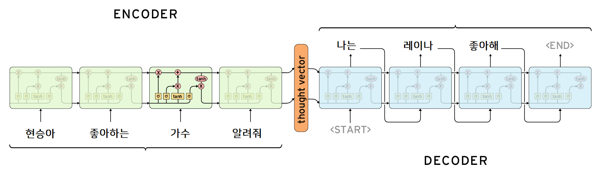

# Tensorflow.js 기반 한국어 Seq2Seq based Chatbot
카카오톡 단톡방 대화에서 자동으로 대화를 추출하여 대화를 학습하고 쉽게 챗봇을 구성할 수 있는 패키지입니다.

[예제사이트는 이곳](http://blcat.kr/aichat/)에서 확인하실 수 있습니다.

예제는 [프로그래밍갤러리 R 사용자 모임](https://open.kakao.com/o/gucyTGFb)에서 추출된 혜성님의 대화로 구성되었습니다.(./js)

#### (주의) 형태소 분석을 위해 개인 Django서버를 경유합니다. 많은 트래픽이 발생할 것으로 예상되는 경우 문의주세요

# 사용 설명서

1. 카카오톡 단톡방 대화 텍스트파일에서 특정 사용자를 지정하면 바로 전 대화와 짝지어서 자동으로 학습 데이터셋을 구성합니다. (./python/0. kakaotalk_preprocessing.ipynb)
2. 학습은 python tensorflow로 진행됩니다. (./python/1. seq2seq_model.ipynb)
3. 학습 완료 결과물은 decoder_model폴더, encoder_model폴더, index_to_word.js, word_to_index.js파일입니다.
4. 학습 완료 후 js폴더에 해당 파일들을 옮겨주신 후, js폴더의 내용물을 통채로 웹서버에 업로드해주세요.

# Architecture
 

# Requirements
- Python 3.7
- Konlpy
- Pandas
- Numpy
- Tensorflow
- Tensorflowjs

# Author
Hyunseung Kong / [@Gumgo91](https://github.com/Gumgo91) (antibody91@naver.com)

# Thanks to
- Mr. Question Mark / https://github.com/mrquestion
- Hyeseong Lee / https://github.com/leec0m3t

# References
- Tensorflow.js API: https://js.tensorflow.org/api/latest/?hl=ko
- Seq2Seq model: https://github.com/deepseasw/seq2seq_chatbot
- Javascript frontend: https://dororongju.tistory.com/151
